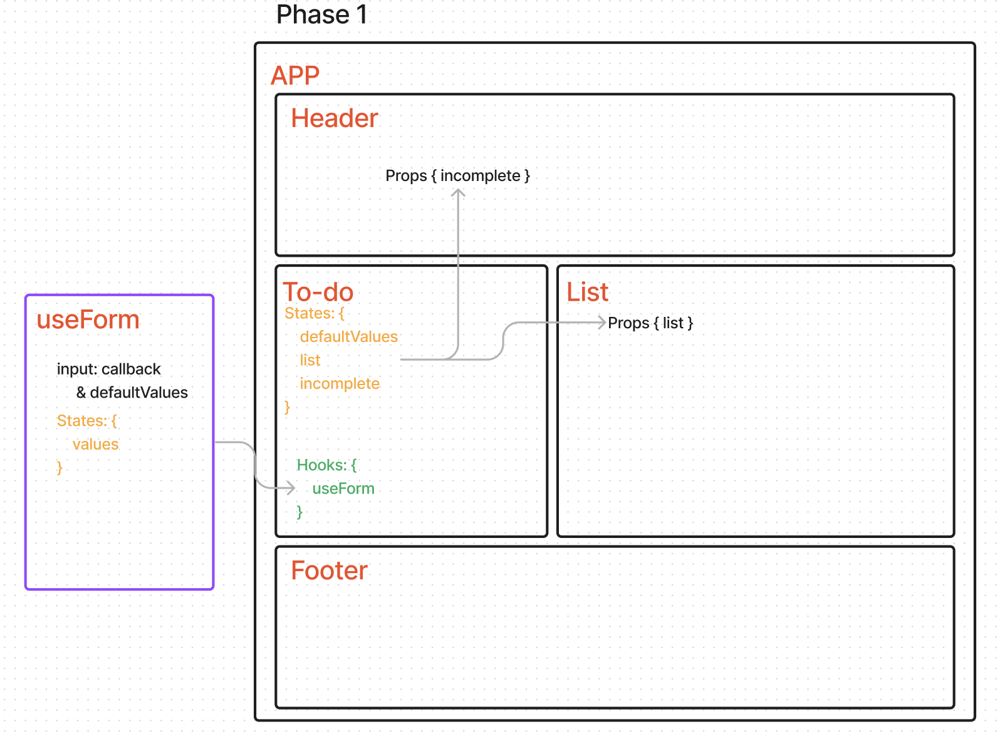
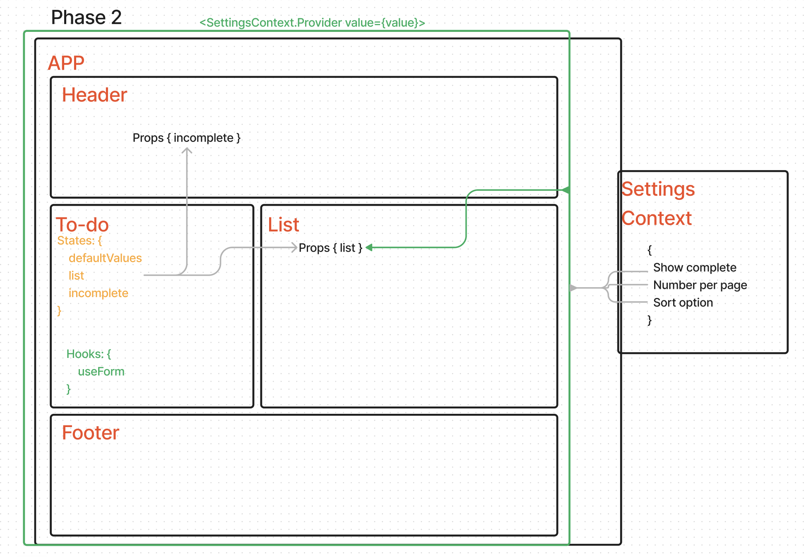
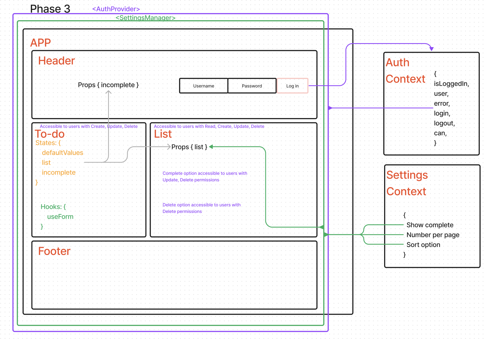
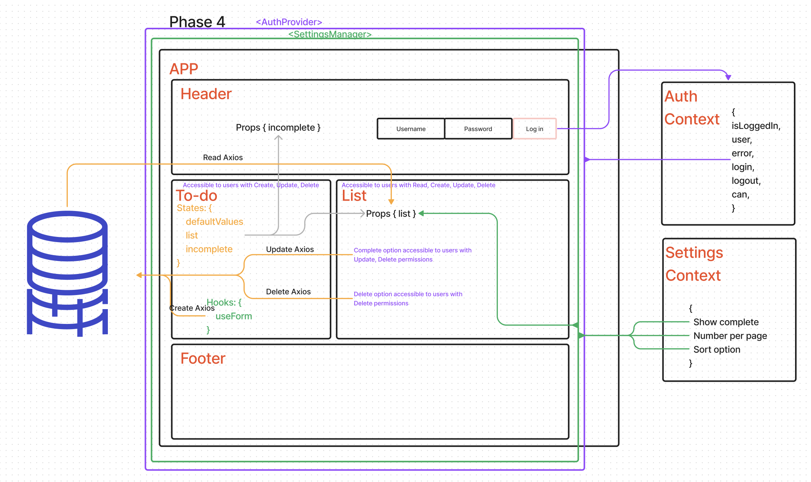

# TO-DO

**Author:** Francisco Sanchez

**Version**: 1.3.0

## Overview

An Application to handle TODO tasks. The functionality to add items to a list was given to start, but was tasked to usilize React's useContext to define a set of Settings through out the Application. The useContext hook was used to resubmit to handle both user settings and authentication for the application. It also uses React Router to handle routing. It uses Mantine for styling, a challenge as no prior experience with the library was had.

## Feature Tasks & Requirements

June 27, 2023 - v1.0.0 - Phase 1\
Create a settings Context component that can define how our components should display elements to the User. React Context was established to define a set of settings through out the Application.\

June 28, 2023 - v1.1.0 - Phase 2\
Continue developement of the Todo application by allowing the ability to change the settings, save them to local storage, and apply them globaly to the application. The useContext hook was used to accomplish this.

June 29, 2023 - v1.2.0 - Phase 3\
Integrated Authentication context to the application using the same methodoloty (use the useContext hook) to allow users be logged in, in order to see the to do items. Additionally, based on their user type, they will be allowed (or denied) to perform actions such as editing or deleting them.

June 30, 2023 - v1.3.0 - Phase 4\
API integration of the todo app to a database. The application allows modifacation of the data based on user permissions.

## Getting Started

1. Using the terminal, navigate to a location directory of your choosing.
2. Clone [RESTy repository](https://github.com/c0d3cisco/resty) from GitHub.
3. Run `cp resty` and `npn i`
4. Run `npm start`. A browser window will open with the React app.

## Architecture

Phase 1 UML\

Phase 2 UML\

Phase 3 UML\

Phase 4 UML\

